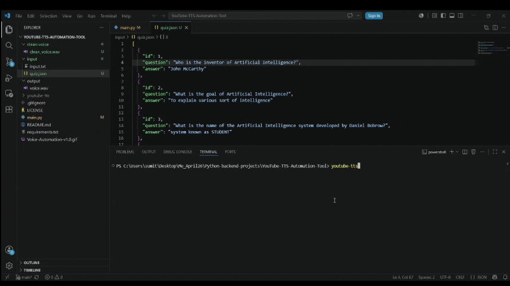

# Voice-Automation ─ v2.0
YouTube TTS Automation Tool

A Python-based Text-to-Speech automation tool that automatically converts text into high-quality speech using Coqui TTS with custom voice cloning. Designed to streamline audio generation for YouTube content, quizzes, narration, and other voice-based applications.

## Features

* Converts text into natural-sounding speech
* Supports custom speaker voice cloning using clean_voice.wav
* Generates audio automatically with minimal user input
* Fast and simple workflow for content creators
* Suitable for YouTube narration, quizzes, and voice automation

## Tech Stack

* Python 3.10
* Coqui TTS

## Project Structure

clean-voice/

* clean_voice.wav

input/

* input.txt

output/

* quiz_audio.mp3

main.py

```
YouTube-TTS-Automation-Tool
├── clean-voice/
│   └── clean_voice.wav
│
├── input/
│   └── quiz.json
│
├── output/
│   └── quiz_audio.mp3
│
├── main.py
│
├── requirements.txt
│
└── README.md
```

## Installation

Clone the repository:
```
git clone <https://github.com/Sumitra29/Voice-Automation.git>
```
Move into the project folder:
```
cd YouTube-TTS-Automation-Tool
```
Install dependencies:
```
pip install -r requirements.txt
```
## Usage

1. Place your text inside input/input.txt
2. Run:
```
python main.py
```
3. Generated audio will be saved inside the output folder.

## Example

Input:
question: What is the goal of Artificial Intelligence?
answer: To explain various sort of intelligence

Output:
quiz_audio.mp3

## Demo
Watch the project in action:
https://youtube.com/shorts/vqpm7Jc0MVU?si=wMkfYN4WMfutzj57
<p align="center">
  
</p>
<p align="center">
  <em>Voice Automation</em>
</p>


## Version History

- v1.0 – Basic text-to-speech automation
- v2.0 – Added custom voice cloning, improved automation, updated documentation