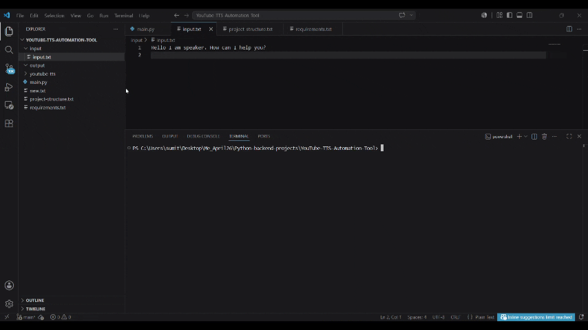

# Voice-Automation ─ v1.0
YouTube TTS Automation Tool

A Python-based Text-to-Speech automation tool that converts text files into speech audio files.

## Features

* Reads text from a text file
* Generates speech audio using Coqui TTS
* Saves generated audio automatically
* Simple workflow for content creation and narration generation

## Tech Stack

* Python 3.10
* Coqui TTS

## Project Structure

input/

* input.txt

output/

* voice.wav

main.py

```
YouTube-TTS-Automation-Tool
├── input/
│   └── script.txt
│
├── output/
│   └── audio.mp3
│
├── main.py
│
├── requirements.txt
│
└── README.md
```

## Installation

Clone the repository:
```
git clone <https://github.com/Sumitra29/Voice-Automation.git>
```
Move into the project folder:
```
cd YouTube-TTS-Automation-Tool
```
Install dependencies:
```
pip install -r requirements.txt
```
## Usage

1. Place your text inside input/input.txt
2. Run:
```
python main.py
```
3. Generated audio will be saved inside the output folder.

## Example

Input:
Hello I am voice clone
How can I help you?

Output:
clone-voice.wav

## Demo
Watch the project in action:
https://youtu.be/qunCWAik1NI?si=FQjKnI4l-K6Swjpr

<p align="center">
  
</p>
<p align="center">
  <em>Mobile view</em>
</p>
